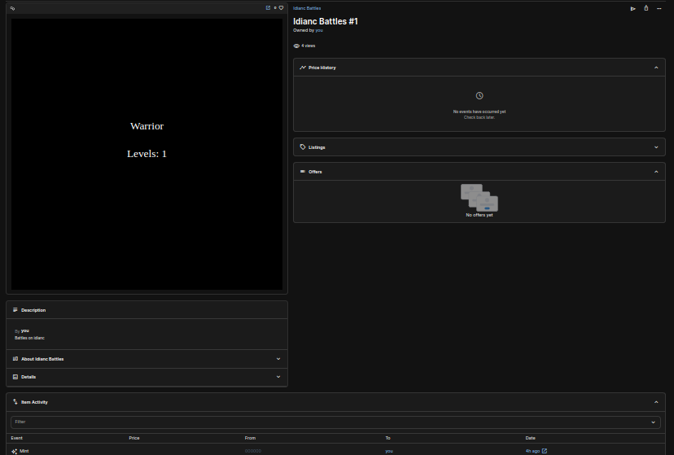

# NFTs with On-Chain Metadata - Hardhat and JavaScript

This project demonstrates a basic fully dynamic NFT with on-chain metadata that changes based on your interactions with it, and deploy it on Polygon Mumbai to lower gas fees.

---

## NfT Properties (IDIANc_bATTLES)

1. ⚙️ NFT stored in metadata on chain
2. ✉️ Deployed on Polygon Mumbai
3. 🏡 Able to modify metadata based on interactions with the NFT

---

## NFT



https://testnets.opensea.io/assets/mumbai/0x2a438d3ceb13f31084def51fc06237cc324b07a5/1

## Steps To Add Polygon Mumbai to your Metamask Wallet

1. ⚙️ Navigate to `mumbai.polygonscan.com`and scroll down to the bottom of the page. You'll see the "Add Polygon Network" button, click on it and confirm you want to add it to Metamask
2. ⛓ Getting Test MATIC just navigate to one of the following faucets:  
   -`mumbaifaucet.com` -`faucet.polygon.technology`

Run the following tasks: related to node.js and Hardhat

```shell
npm install
npm -y init
npx hardhat init
npx hardhat test
npx hardhat run scripts/Deploy.js
```

## npm Install Commands: of the Dependencies

```shell
npm install @nomicfoundation/hardhat-toolbox@4.0.0
npm install @nomiclabs/hardhat-etherscan@3.1.7
npm install @nomiclabs/hardhat-waffle@2.0.6
npm install @openzeppelin/contracts@4.9.3
npm install dotenv@16.3.1
npm install ethers@5.7.2
```


## Deployed the NFTs On-Chain Metadata Smart Contract

🥾 Two applications 
 ☝️ Alchemy .com 
 🎯 Polygonscan.com

---

### View your Dynamic NFT On OpenSea

-testnet.opensea.com:

---

## IdiancBattles.sol
Certainly! The provided Solidity code defines a contract called `IdiancBattles`, an ERC721 token (NFT) that includes functionality for creating and managing unique tokens representing characters for battles.


---

Let's break down the code and its functionalities into explanatory statements:

### Contract Initialization and Imports:
- The contract inherits from `ERC721URIStorage` in the OpenZeppelin library, enabling it to implement the ERC721 token standard with URI storage capabilities.
- It imports necessary libraries (`Counters.sol`, `Strings.sol`, `Base64.sol`) for managing token IDs, string manipulation, and Base64 encoding.

### Contract Structure and Data Structures:
- The contract includes a counter `_tokenIds` to manage token IDs and a mapping `tokenIdToLevels` to associate each token ID with its corresponding level.

### Constructor:
- The constructor initializes the contract with a name "Idianc Battles" and a symbol "CBTLS" for the NFT.

### `generateCharacter` Function:
- This function generates an SVG representation for a specific NFT (character) based on its `tokenId`.
- It constructs an SVG string representing the character's visualization using the `abi.encodePacked()` function.
- The SVG includes a black background, text displaying the character type ("Warrior"), and the character's level obtained from `getLevels()`.

### `getLevels` Function:
- This function retrieves the level associated with a specific `tokenId` from the `tokenIdToLevels` mapping and converts it to a string.

### `getTokenURI` Function:
- Generates the token URI for a specific `tokenId`.
- Creates a JSON structure representing the token metadata (name, description, and image).
- The image is constructed by calling `generateCharacter()` to get the SVG representation and encoding it to Base64.

### `mint` Function:
- Increments the `_tokenIds` counter to generate a new `tokenId`.
- Mints a new token (`_safeMint`) for the caller (msg.sender).
- Initializes the level for the new token as 0 and sets its token URI using `getTokenURI()`.

### `train` Function:
- Allows the owner of a token to increment its level.
- Checks if the token exists and verifies that the caller is the token owner.
- Increments the token's level in `tokenIdToLevels` and updates its token URI accordingly.

### Summary:
- The contract enables the minting of unique ERC721 tokens (NFTs) representing characters for battles.
- It provides functionalities to generate character visuals (SVG-based), retrieve token levels, mint new tokens, and increment token levels through training (restricted to token owners).


``@Dennys_wambs_IDEANC
